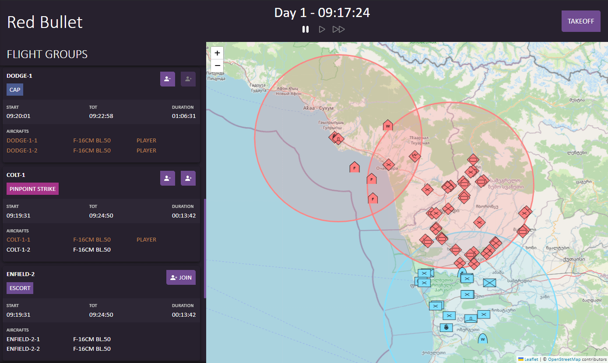

# DCC - Digital Crew Chief


100% flying, 0% configuration.

DCC is meant to be a toolkit offering simple apps to enhance your flying experience in [Digital Combat Simulator](https://www.digitalcombatsimulator.com/).\
Still in early development we currently only offer a dynamic campaign, but more apps are planned (see [Roadmap](#roadmap)).

- [Dynamic Campaign](#dynamic-campaign)
  - [How does the Campaign work](#how-does-the-campaign-work)
  - [Persistance](#persistance)
  - [Upcoming Features](#upcoming-features)
- [Roadmap](#roadmap)
- [Contributing](#contributing)
- [Contributors](#contributors)


## Dynamic Campaign
Campaign Mode for Digital Combat Simulator(DCS) inspired by Falcon BMS and Liberation
---no configuration, just fly---




### How does the Campaign work
The campaign is defined by two definition, Scenario and faction.
This two definitions are currently not editable but will be in the future.
Once the campaign is started each site/faction tries to archive the defined win condition automatically.
The player can always chose the occupy one (or more) of the planned or active flight group/mission and play the mission out in DCS.
After flying the mission in DCS the results are processed back in to the campaign.

#### Scenario
The scenario defines on which map and when the campaign takes place. It also says what the win condition is. And what objective and structures are allocated to which side at the start of the campaign.

#### Faction
This defines which planes, helicopters and ground units is available for the given faction. The aircrafts are categories into the different mission types available.

#### Structures
Structures are a collection of building which provide a service for the controlling faction. To prevent this services the opposite faction can destroy the buildings with a Strike mission or capture the structure with ground units.
Is a building destroyed it will be repaired over a period of time.

##### Ammo Depot
Provides Ammo for Barracks and Depots nearby to improve the deploy time of this structures.

##### Barrack
Deploys periodically infantry units to enemy objectives.

##### Command Center
Controls the SAM Network(IADS) - coming coon

##### Depot
Deploys periodically vehicle units to enemy objectives.

##### Farp
Allows the use Helicopters near the frontline

##### Power Plant
Provides electricity to structures and SAMs(IADS - coming soon) nearby to improve the deploy time of this structures.

##### Fuel Storage
Provides Fuel for Depots nearby to improve the deploy time of this structures.

### Persistance
Make sure DCS allows DCC to save it state with the following step.
This needs do be done after each DCS update.
Change the following lines in the file in the DCS installation folder 'DCS World/Scripts/MissionScripting.lua'
From:
```
do
   sanitizeModule('os')
   sanitizeModule('io')
   sanitizeModule('lfs')
   _G['require'] = nil
   _G['loadlib'] = nil
   _G['package'] = nil
end
```
To:
```
do
   sanitizeModule('os')
   --sanitizeModule('io')
   --sanitizeModule('lfs')
   _G['require'] = nil
   _G['loadlib'] = nil
   _G['package'] = nil
end
```
### Upcoming Features

- Carrier
- More Maps
- More Scenarios
- More Factions
- More Package Types
- IADS
- In App customizing Scenarios and Factions
- Improved Frontline logic
- Kneeboard
- Warehouse
- Recon / Fog of War

## Roadmap

- Quick Mission: Create a simple mission that offers immersion into a battlefield
- Patcher: Apply patches to DCS to easily configure your setup
- Controls: Drag & Drop setup for your Joystick / Throttle
- Mods: Install and Remove supported DCS mods with a simple click

## Contributing

Contributions are always welcome!\
See [contributing](CONTRIBUTING.md) for ways to get started.\
Please adhere to this project's [code of conduct](CODE_OF_CONDUCT.md).

## Contributors
- [@Kilcekru](https://github.com/kilcekru)
- [@rhyver](https://github.com/rhyver)